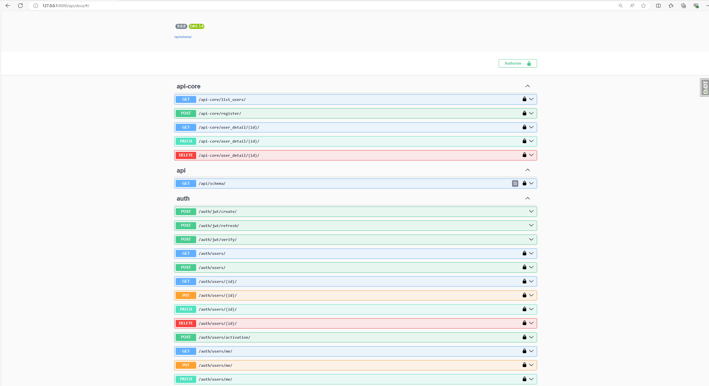

# Fablight

---

## Стек
#### 1. Backend - Django rest framework
#### 2. DB - sqlite3

---

## Регистрация

#### Для регистрации используется библиотека Djoser. Я использовал jwt токены. Настройки jwt можно посмотреть в файле settings

---

## Хеширование паролей 

#### Для хеширования я использовал стандарт argon2

```python
PASSWORD_HASHERS = [
    "django.contrib.auth.hashers.Argon2PasswordHasher",
    "django.contrib.auth.hashers.PBKDF2PasswordHasher",
    "django.contrib.auth.hashers.PBKDF2SHA1PasswordHasher",
    "django.contrib.auth.hashers.BCryptSHA256PasswordHasher",
    "django.contrib.auth.hashers.ScryptPasswordHasher",
]
```

---

## Документирование 

#### Для документирования используется SWAGGER. Подключив библиотеку drf_spectacular



---

## Эндпоинты 

#### 1. /auth/jwt/create/ - авторизация. Генерирует 2 jwt токены 
#### 2. /api-core/list_users/ - список пользователей
#### 3. /api-core/register/ - регистрация пользователей 
#### 4. /api-core/user_detail/ - обновление и удаление пользователя 